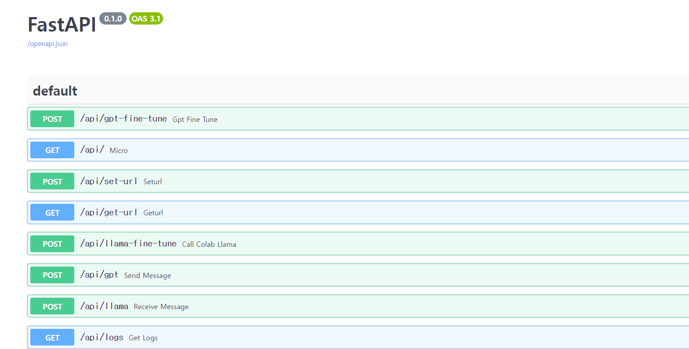
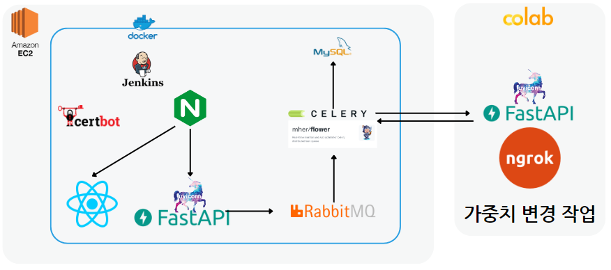
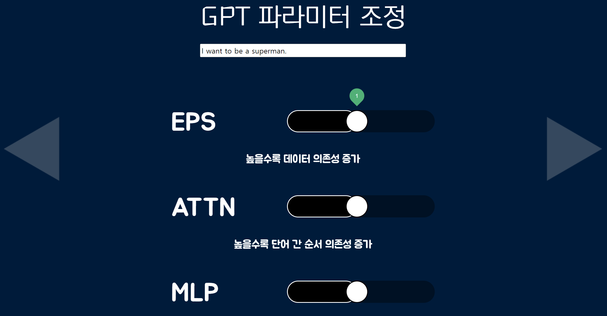

# 아임파인 😊

개발 기간 : 2023.10.10 ~ 2023.11.17

`#AI` `#파인튜닝`

<br>
<br>

## :rainbow: 아임파인 :blush:

- ### 프로젝트 개요
  
  {: width="200" height="200"}
 
  - `아임파인`은 pre-trained model을 파인튜닝하여 모델을 생성하고, 생성된 모델의 입출력을 보여주는 서비스입니다.

- ### 주요 기능
  
  - **Llama2 모델 Fine-tuning**
    
    > 1) 70억개의 파라미터 중 **ATTN과 MLP**의 가중치를 조정하여 파인튜닝한다. 
    > 
    > 2) 텍스트를 입력하고, 파인튜닝 된 모델에서의 **텍스트 결과**를 확인할 수 있다.
  
  - **GPT2 모델 Fine-tuning** 
    
    > 1) 1.5억개의 파라미터 중 **ATTN과 MLP**의 가중치를 조정하여 파인튜닝한다. 
    > 
    > 2) 텍스트를 입력하고, 파인튜닝 된 모델에서의 **텍스트 결과**를 확인할 수 있다.
  
  - **Stable Diffusion**
    
    > 1) 1133개의 레이어 중 **143개의 레이어**의 파라미터를 조정하여 파인튜닝한다. 
    > 
    > 2) 텍스트를 입력하고, 파인튜닝 된 모델에서의 **이미지 결과**를 확인할 수 있다.

- ### 향후 계획
  
  - **모델 제공** : 사용자의 로컬환경에 호환되는 모델서비스를 제공.
  - **실시간 출력** : 파라미터 조정시간을 단축시켜 텍스트 입력에 따른 즉시 출력.
  - **파라미터 사전 세팅** : 파라미터 조정에 따른 결과를 미리 분석해 사용자에게 세팅값 제공.

<br>
<br>

## 📌 목차

[아임파인 😊](#rainbow-아임파인-blush) 

* [시작하기](#triangular_flag_on_post-시작하기)

* [지원하는 브라우저](#globe_with_meridians-지원하는-브라우저)

* [사용된 도구](#hammer_and_wrench-사용된-도구)

* [사용된 기술](#desktop_computer-사용된-기술)

* [시스템 아키텍쳐](#desktop_computer-시스템-아키텍쳐)

* [서비스 소개](#-서비스-소개)

* [저자](#-저자)

<br>
<br>

## :triangular_flag_on_post: 시작하기

### 4.1. server 실행

1. **원격 저장소 복제(git clone)**

```bash
$ https://lab.ssafy.com/s09-final/S09P31D109.git
```

2. **프로젝트 폴더로 이동**

```bash
$ cd finetune-back\src
```

3. **패키지 설치**

```bash
$ pip install -r requirements.txt
```

4. **main 메서드 실행하기**

```bash
$ uvicorn main:app --reload
```

<br>

### 4.2. web 실행

1. **프로젝트 폴더로 이동**

```bash
$ cd finetune-web
```

2. **npm 설치**

```bash
$ npm i
```

3. **npm 실행**

```bash
$ npm start
```

<br>
<br>

## :globe_with_meridians: 지원하는 브라우저

| Chrome | Safari | Edge   | Firefox |
| ------ | ------ | ------ | ------- |
| latest | latest | latest | latest  |

<br>
<br>

## :hammer_and_wrench: 사용된 도구

* python 3.8
* FastAPI
* node 14
* react
* GitLab
* Jira

<br>
<br>

## :desktop_computer: 사용된 기술

**[ BACK END ]**

- **FastAPI**  : 아임파인 Project의 전반적인 Rest Controller 구현
{: width="600" height="300"}
<br>
- **RabbitMQ**  : FastAPI에서 코랩에 요청할 작업을 담을 MQ로, 브로커로 사용.
{: width="600" height="300"}
<br>
- **Celery**  : RabbitMQ에 담겨있는 task를 확인하고 꺼내어 작업하기 위해 사용.
  - Colab에서 처리하는 작업은 시간이 오래 걸리므로 긴 시간 동안 응답을 받기 위해 연결을 유지하는 것은 비효율적이기에 사용.
- **Flower**  : Celery에서 처리하는 작업을 GUI로 확인하기 위한 라이브러리
{: width="1200" height="300"}
<br>
- **SSL 프로토콜** : SSL을 적용하여 전송되는 패킷값을 암호화하여 외부의 공격자로부터 데이터를 보안하기 위해 사용.
  - Let's Encypt 무료 인증서를 발급받아 웹서버에 SSL 인증서를 적용.
- **AWS** : EC2 서비스를 이용하여 Ubuntu 서버를 구축 (호스팅).
- **Nginx** : 웹 서버를 구축
  - React, FastAPI에 reverse proxy 설정

- **Google Colab** : 파인튜닝을 하기 위한 GPU 서버.
- **Ngrok** : Colab의 서버를 외부에 노출시켜 API를 호출하기 위해 사용.
<br>

**[ FRONT END ]**

- **React** : 아임파인 Project의 Web 구현

<br>

**[ TEAM Cooperation ]**

- **GitLab**: GitLab을 활용하여 프로젝트를 관리.
  - Git Flow 에 따른 브랜치 전략 수립.
  - MR 시 코드 리뷰 진행.
- **Jira**: 이슈 관리 도구로 활용.
  - 주요 기능들을 이슈로 등록하고 Stroy Point를 산정한 후, 담당자를 지정하여 프로젝트를 진행.
  - 1~2 주 정도 상황에 맞게 스프린트를 설정.
- **Google Drive** : 협업을 위한 공용 문서 및 산출물들을 공유할 수 있도록 활용.
  - 동시 문서 작성 (Google Docs).
  - 대용량 파일 첨부.
- **Notion** 
  - 일정 관리 및 트러블 슈팅 메모.
  - 세션을 통해 새로운 지식 공유.

<br>
<br>

## :desktop_computer: 시스템 아키텍쳐

{: width="500" height="300"}

<br>
<br>

## 🎞 서비스 소개

### 1. pre-trained 모델 선택

{: width="500" height="300"}

- **[LLAMA 클릭 시] :** LLAMA2 모델의 파라미터를 조정한다.
- **[GPT 클릭 시] :** GPT2 모델의 파라미터를 조정한다.
- **[Stable Diffusion 클릭 시] :** Stable Diffusion 모델의 파라미터를 조정한다.

---

### 2. 사용자 입력

{: width="500" height="300"}

- 사용자가 텍스트 입력 후 파라미터 값 직접 조정
- **[EPS 조정 시] :** 데이터 의존성 조정.
- **[ATTN 조정 시] :** 단어 간 순서 의존성 조정.
- **[MLP 조정 시] :** 단어 간 연관성 조정.

---

### 3. 로딩 화면

{: width="300" height="300"}

- 조정한 파라미터 값으로 파인튜닝 및 입력에 해당하는 답변 출력 대기.

---

### 4.출력 화면

{: width="400" height="300"}

- 파인튜닝 된 모델의 답변 출력.

<br>
<br>

## 👤 저자

- 김현진 - Hyunjin Kim - [Back]
- 김형진 - Hyungjin Kim - [Back]
- 박현우 - Hyunwoo Park - [Front]
- 손민균 - Minkyun Son - [Back]
- 이상혁 - Sanghyuk Lee - [Back]
- 이현근 - Yongwoo Jeong - [Back]
